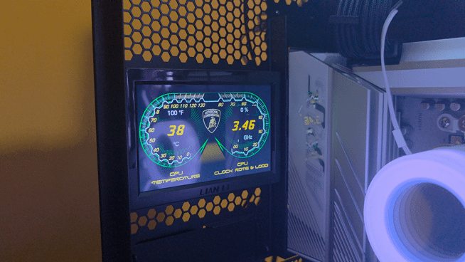

# Lambo Dashboard for Linux


Streams a Lamborghini-style dashboard to the Lian Li O11D EVO RGB Lamborghini
Edition's rear panel, live, from a Linux host -- **no files written to the
panel's own storage**, and no need for the Windows-only official driver.

Confirmed working hardware: Turing 5" panel family (enumerates as
`Manufacturer: Turing`, `Product: UsbMonitor`, `SerialNumber: CT50INCH`).
This is the same panel hardware family used inside the Lian Li case, so this
should also work on standalone Turing/TURZX 5" USB panels.

This repo includes the dashboard background art and fonts extracted from the
official driver, for convenience. These are Lamborghini/Lian Li's assets,
included here at the repo owner's discretion -- not a claim of ownership.
If you're forking/redistributing this and want to avoid that, swap them out
for your own or remove `res/` and supply your own via `$LAMBO_DASHBOARD_RES`.



## Quick start (prebuilt binary)

1. Download the latest `lambo-dashboard-linux-x86_64.tar.gz` from
   [Releases](../../releases).
2. Extract and run:
   ```bash
   tar -xzf lambo-dashboard-linux-x86_64.tar.gz
   cd lambo-dashboard-linux-x86_64
   chmod +x install.sh detect.sh
   ./detect.sh        # confirms your panel is recognized
   ./install.sh        # installs the binary, udev rule, optional autostart
   lambo-dashboard
   ```

No `dialout` group membership or relogin needed -- the installed udev rule
grants access by the panel's serial number directly.

## How it works

- The panel's original background clips turned out to be the same two pages
  (CPU dashboard, GPU dashboard) baked in 8 different lighting-color skins
  matching the case's RGB sync -- not 16 different pages (`res/backgrounds/`
  has one clean frame per skin already extracted).
- The placeholder numbers baked into that art are painted over each refresh
  with the gauge's dark interior color, then the real live number is drawn
  on top using the bundled digit and label fonts (`res/fonts/`).
- Each composited frame is pushed to the panel with `DisplayPILImage()` over
  serial -- the same primitive the original driver uses, just with real
  sensor data instead of a canned demo.
- `library/` is a small vendored subset (just the files needed to talk to
  this panel) of `turing-smart-screen-python` (GPL-3.0-or-later, see
  `library/LICENSE`) -- no external clone needed.
- The panel is found automatically by its serial number (`CT50INCH`), so
  this works regardless of what `/dev/ttyACMx` it happens to enumerate as.

## Running from source (for development)

```bash
pip install pyserial pillow psutil numpy
python3 lambo_dashboard.py
```

## Building the binary yourself

```bash
chmod +x packaging/build.sh packaging/install.sh packaging/detect.sh
packaging/build.sh          # produces dist/lambo-dashboard (assets baked in)
packaging/install.sh        # installs it, udev rule, optional autostart
```

### Portability notes

- The official release binary is built on Ubuntu 22.04 in CI (the oldest
  currently-supported GitHub-hosted runner image) for reasonably wide glibc
  compatibility across newer distros. If you build locally on a
  bleeding-edge distro instead, the result may not run on older ones.
- x86-64 Linux only; rebuild on ARM if you need e.g. a Raspberry Pi.

## Run automatically on login (autostart)

If you used `install.sh` and answered "y" to the systemd prompt, this is
already set up — skip ahead. Otherwise, to enable it manually (or add it
after the fact):

```bash
mkdir -p ~/.config/systemd/user
cp packaging/lambo-dashboard.service ~/.config/systemd/user/
systemctl --user daemon-reload
systemctl --user enable --now lambo-dashboard.service
```

Useful commands:

```bash
systemctl --user status lambo-dashboard      # check if it's running
systemctl --user restart lambo-dashboard     # restart it (e.g. after unplugging the panel)
systemctl --user stop lambo-dashboard        # stop it now
systemctl --user disable lambo-dashboard     # stop it from autostarting
journalctl --user -u lambo-dashboard -f      # follow its live logs
```

If you want it to start even without an active graphical login (e.g.
headless or server-like use), also enable linger for your user:

```bash
sudo loginctl enable-linger $USER
```

## Uninstalling

```bash
chmod +x uninstall.sh   # or packaging/uninstall.sh if building from source
./uninstall.sh
```

This stops and disables the service, and removes the binary, udev rule, and
systemd unit. It won't touch anything outside what `install.sh` created.

## What does install.sh actually do?

Worth checking before running any script with `sudo` from a repo you don't
know -- here's the complete list, no surprises:

1. Copies the `lambo-dashboard` binary to `/usr/local/bin/` (needs sudo).
2. Copies a udev rule to `/etc/udev/rules.d/99-lambo-dashboard.rules` that
   grants read/write access to a USB serial device matching the panel's
   known serial number (`CT50INCH`) -- and nothing else (needs sudo).
3. Reloads udev rules (`udevadm control --reload-rules` / `trigger`).
4. Optionally (only if you say yes at the prompt) copies a systemd user
   service file to `~/.config/systemd/user/` and enables it -- this runs
   entirely as your own user, not as root.

It does not touch any other files, does not phone home, and does not
modify anything outside those specific paths. Read `packaging/install.sh`
yourself if you want to verify this directly -- it's short.

## Configuration

Environment variables:

| Variable                  | Default | Purpose                                     |
|----------------------------|---------|----------------------------------------------|
| `LAMBO_DASHBOARD_RES`      | (unset) | Override path to an asset folder             |
| `LAMBO_DASHBOARD_COLOR`    | `c1`    | Which lighting-color skin (`c1`-`c8`)        |

Other settings (refresh rate, gauge text positions, orientation) are
constants at the top of `lambo_dashboard.py` -- edit and rebuild as needed.

## Known rough edges / contributions welcome

- `REGIONS` coordinates are close but not pixel-perfect on every panel
  orientation -- PRs welcome if you nail down exact values.
- `COLOR_VARIANT` is fixed per-run; it doesn't follow the case's live RGB
  lighting mode automatically. Wiring this up (e.g. via OpenRGB) would be a
  nice addition.
- Only CPU stats are shown (temp / clock / load) in this version. An AMD
  GPU sysfs-based reader and NVIDIA `pynvml`-based reader have both been
  prototyped and could be added back as a `--gpu` page.
- Refresh is throttled to 1 full-frame push/second -- serial bandwidth is
  the real ceiling for host-streamed frames; PRs improving this are welcome.
- Tested on one specific panel/machine combination -- if you get this
  running on different hardware or distros, please open a PR updating this
  README with what worked.

## Troubleshooting

**"Permission denied" opening the serial port**: the udev rule from
`install.sh` should prevent this on a fresh install. If running from source
without it, add yourself to the `dialout` group and log out/in:
```bash
sudo usermod -aG dialout $USER
```

**Panel not found**: run `packaging/detect.sh` (or `dmesg | tail` after
plugging in) to confirm the panel enumerates and check its serial number
matches what's expected.

## Known working hardware

Confirmed: Lian Li O11D EVO RGB Automobili Lamborghini Edition's built-in
5" panel (`SerialNumber: CT50INCH`).

If you get this running on a different panel, case, or distro, please open
an issue or PR with what you tried and what worked -- this list is meant to
grow with real reports, not guesses.

## Notes for contributors (CI gotchas already hit once)

A couple of non-obvious things that broke the release pipeline during
initial setup, documented here so nobody has to rediscover them:

- **`ubuntu-20.04` runner image was removed by GitHub in April 2025.**
  Jobs using it queue forever waiting for a runner that no longer exists,
  rather than failing outright. If a future GitHub deprecation does the
  same to `ubuntu-22.04`, the workflow will need bumping again.
- **`GITHUB_TOKEN` defaults to read-only.** Creating a release via
  `softprops/action-gh-release` needs an explicit
  `permissions: contents: write` block in the workflow (already present
  in `release.yml`) -- without it, the job fails with a 403 partway
  through, after the binary's already built.

## Acknowledgments

This project exists because of the reverse-engineering and protocol work
done by [mathoudebine](https://github.com/mathoudebine) and contributors on
[turing-smart-screen-python](https://github.com/mathoudebine/turing-smart-screen-python).
The `library/` folder here is a small vendored subset of that project's
code, used as-is to talk to the panel over serial. If you found this repo
useful, that project deserves the credit for the underlying hardware
support -- it covers a much wider range of panels than just this one, and
is worth a star in its own right.

## License

This project as a whole is licensed under GPL-3.0-or-later (see `LICENSE`).
This is because it vendors and depends on code from
`turing-smart-screen-python` (`library/`, GPL-3.0-or-later, see
`library/LICENSE`) -- the combined work, including any compiled binary built
from it, is bound by those terms.

The Lamborghini/Lian Li background art and fonts in `res/` are their
respective owners' intellectual property, included here for functionality,
not under any claim of ownership by this project.
